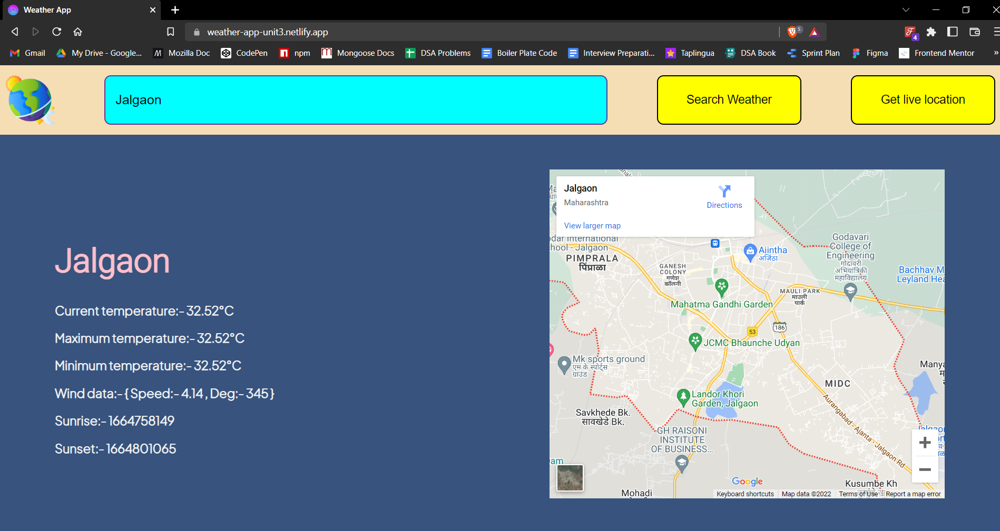
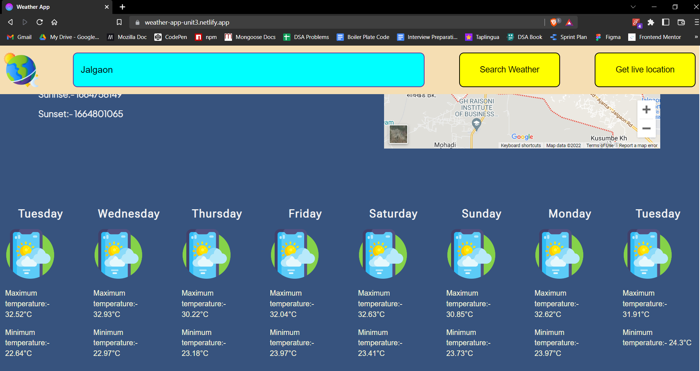
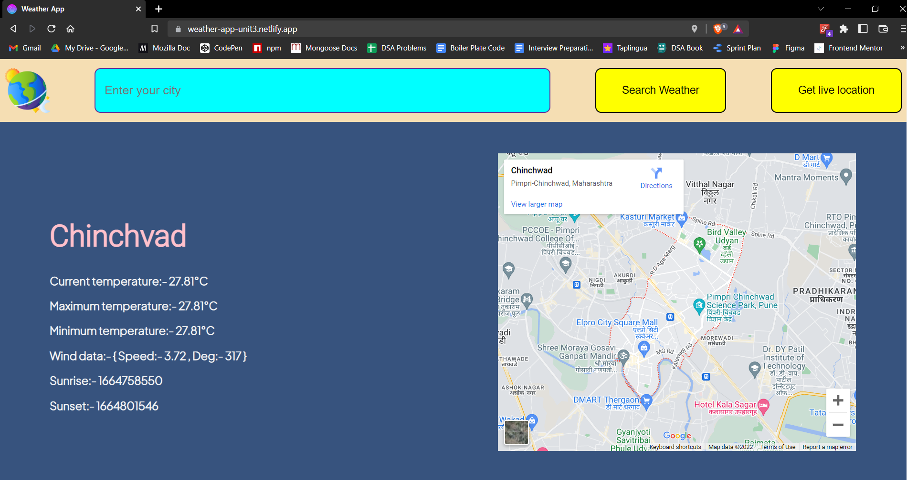

# Weather App

Hello everyone, here is my Weather App project the help of `https://openweathermap.org/api` and `https://www.embedgooglemap.net/` api's. Link of deployment:- https://weather-app-unit3.netlify.app/

## Features

- Search any city and get weather.
- Get weather for next 7 days.
- Get weather data by live location.
- Responsive layout.

## Screenshots

### 1. Search Results

### 2. Seven Days Weather Data

### 3. Get Live Location

## Tech Stack

In this project we used following tech stacks:- 
- [HTML](https://developer.mozilla.org/en-US/docs/Web/HTML)
- [CSS](https://developer.mozilla.org/en-US/docs/Web/CSS)
- [JS](https://developer.mozilla.org/en-US/docs/Web/JavaScript)
- [Media Queries](https://developer.mozilla.org/en-US/docs/Web/CSS/Media_Queries/Using_media_queries)

